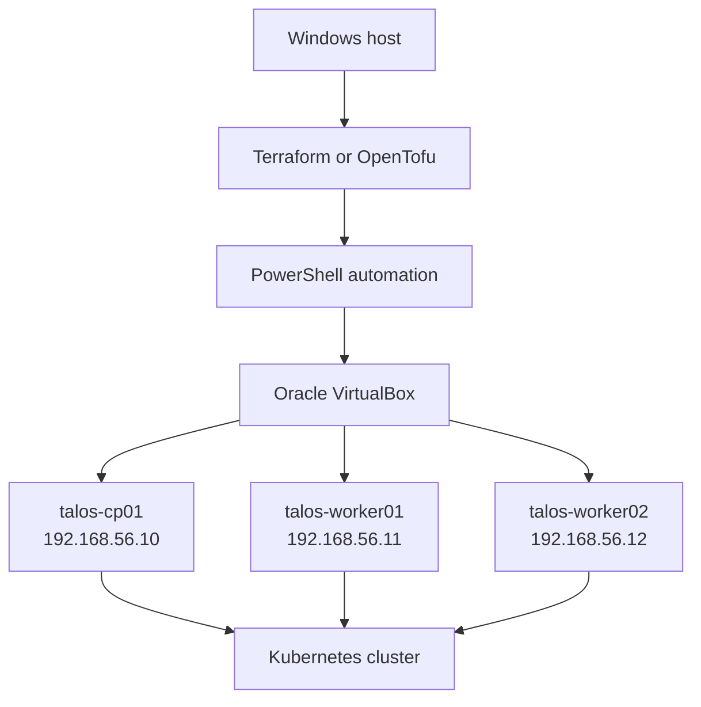

# Talos VirtualBox Homelab

A reproducible three-node Kubernetes lab for Windows using Terraform/OpenTofu,
PowerShell, Oracle VirtualBox, and Talos Linux.

## Architecture



Each VM has two adapters:

- a host-only adapter for deterministic management addresses;
- a NAT adapter for pulling container images and updates.

## What the automation does

1. Downloads the Talos metal ISO when it is not already cached.
2. Creates the VirtualBox host-only network and DHCP reservations.
3. Creates one control-plane VM and two worker VMs.
4. Generates Talos machine configuration and installs Talos to each virtual disk.
5. Bootstraps etcd, writes an isolated kubeconfig, and verifies the nodes.
6. Removes the complete lab with `terraform destroy`.

## Prerequisites

- Windows 10/11 with hardware virtualization enabled
- Oracle VirtualBox 7.x
- Terraform 1.6+ or OpenTofu 1.6+
- `talosctl`
- `kubectl`
- PowerShell 7 recommended (Windows PowerShell 5.1 also works)
- approximately 8 vCPUs, 12 GB free RAM, and 75 GB free disk for the defaults

Install command-line tools with `winget` where available:

```powershell
winget install Oracle.VirtualBox
winget install Hashicorp.Terraform
winget install Kubernetes.kubectl
winget install Sidero.talosctl
```

Close and reopen PowerShell after installation, then validate:

```powershell
.\scripts\Test-Prerequisites.ps1
```

## Quick start

Run PowerShell from the repository root:

```powershell
cd terraform
Copy-Item terraform.tfvars.example terraform.tfvars

terraform init
terraform plan
terraform apply
```

The default `auto_bootstrap = true` provisions the VMs and bootstraps the Talos
cluster. Generated credentials are written under `talos/generated/` and are
ignored by Git.

Verify the result:

```powershell
$env:TALOSCONFIG = (Resolve-Path ..\talos\generated\talosconfig)
talosctl health

kubectl --kubeconfig ..\talos\generated\kubeconfig get nodes -o wide
```

If you set `auto_bootstrap = false`, create only the VMs with Terraform and then
run the bootstrap manually:

```powershell
..\scripts\Bootstrap-Talos.ps1 `
  -ClusterName homelab `
  -ControlPlaneIp 192.168.56.10 `
  -WorkerIps 192.168.56.11,192.168.56.12 `
  -InstallDisk /dev/sda
```

## Tear down and rebuild

```powershell
terraform destroy
terraform apply
```

`terraform destroy` deletes only the VMs declared by this project. The shared
VirtualBox host-only adapter is retained by default so other labs are not
disrupted.

## Configuration

Edit `terraform/terraform.tfvars`. The most useful settings are:

| Variable | Default | Purpose |
|---|---:|---|
| `control_plane_ip` | `192.168.56.10` | Kubernetes API and Talos endpoint |
| `worker_ips` | `.11`, `.12` | Worker management addresses |
| `vm_memory_mb` | `4096` | RAM per VM |
| `vm_cpus` | `2` | vCPUs per VM |
| `disk_size_mb` | `30720` | Disk size per VM |
| `host_only_adapter` | `VirtualBox Host-Only Ethernet Adapter` | Windows VirtualBox adapter |
| `talos_version` | `v1.14.1` | Talos ISO version |
| `auto_bootstrap` | `true` | Build the cluster during apply |

## Security notes

The generated `talosconfig`, machine configurations, and kubeconfig contain
cluster credentials. They are excluded by `.gitignore`; do not commit or share
them. This repository is intended for a local learning environment, not a
production deployment.

## Next steps

- Replace the default CNI with Cilium.
- Install Gateway API resources and an ingress gateway.
- Bootstrap Argo CD and manage add-ons through GitOps.
- Add Prometheus, Grafana, and OpenTelemetry.
- Experiment with Talos upgrades and machine configuration patches.

See [docs/architecture.md](docs/architecture.md) for design details and
[docs/k3s-comparison.md](docs/k3s-comparison.md) for a separate Ubuntu + k3s lab
pattern.
